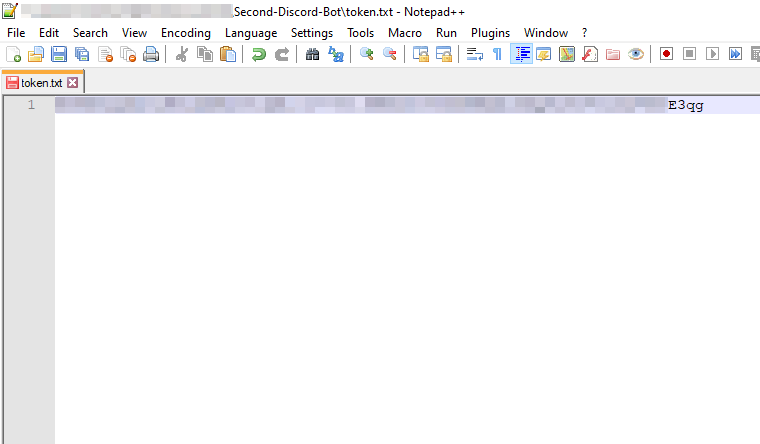

# Dee's Discord Bot: CatBot
This is my second attempt at making a Discord bot in Python.

### Features
- Kick, ban and warn system
- Automatic database management
- Logging system
- Database written in JSON
- Several fun commands
- Role reactions

### Requirements
- Python 3.8 or Higher
- discord.py 2.0.0 or higher

### Installation
1. Install discord.py

   Follow the instructions on https://pypi.org/project/discord.py/
2. Clone this repository to the desired folder
   ```cmd
   git clone https://github.com/Dee419/Second-Discord-Bot
   ```
3. Put your bot's token in the first line of `token.txt`

   Example:
   

4. Run CatBot.py
   - Windows
     ```cmd
     python CatBot.py
     ```
   - Linux
     ```bash
     python3 CatBot.py
     ```

### Commands:
1. General Commands
   - List Kicks
     - Lists all of the kicks of a specific user
     - If you have `administrator` perms then you can do `.listkicks all` to show all the kicks on the server
     - Be warned! In case the server has many kick entries it could flood the channel
     - Usage `.listkicks (Optional)Member-Mention/User-Id/'all'`
     - Examples: `.listkicks`, `.listkicks 206398035654213633`, `.listkicks all`
   - List Bans
     - Lists all of the bans of a specific user
     - If you have `administrator` perms then you can do `.listbans all` to show all the bans on the server
     - Be warned! In case the server has many ban entries it could flood the channel
     - Usage `.listbans (Optional)Member-Mention/User-Id/'all'`
     - Examples: `.listbans`, `.listbans 206398035654213633`, `.listbans all`
   - List Warns
     - Lists all of the warns of a specific user
     - If you have `administrator` perms then you can do `.listwarns all` to show all the warns on the server
     - Be warned! In case the server has many warn entries it could flood the channel
     - Usage `.listwarns (Optional)Member-Mention/User-Id/'all'`
     - Examples: `.listwarns`, `.listwarns 206398035654213633`, `.listwarns all`
2. Moderation commands
   - Kick
     - Allows the user to kick a member
     - Usage: `.kick Member-Mention/Member-ID (Optional)Reason`
     - Example: `.kick 206398035654213633 Toxic Behaviour`
   - Ban
     - Allows the user to ban a user
     - The user in question does not need to be on the serve
     - Usage: `.ban Member-Mention/User-ID (Optional)Reason`
     - Example: `.ban 206398035654213633 Hate Speech`
   - Warn
     - Allows the user to warn a member
     - Usage: `.kick Member-Mention/Member-ID (Optional)Reason`
     - Example: `.warn 206398035654213633 Suggestive Image`
   - Purge
     - Allows the user to purge a given amount of messages
     - You can also choose whose messages are to be purged
     - Usage: `.purge Amount-Of-Messages (Optional)User-ID`
     - Example: `.purge 10 206398035654213633`
3. Admin commands
   - Requires `Administrator` perms for the command user
   - Set chat log channel
     - Allows the user to set the log channel
     - The log channel logs all deleted and edited messages and also logs members entering and leaving the server
     - Either provide the channel or use in the intended channel
     - Aliases: `.sclc`, `.setclc`
     - Usage: `.setchatlogchannel (Optional)Channel_ID`
     - Examples: `.setchatlogchannel 988180984337928212`, `.setchatlogchannel`
4. Role Reactions
   - Requires `Administrator` perms for the command user and `Manage Role` perms for the bot
   - Setup for **adding** a role reaction
     - Starts the setup for **adding** a role reaction message.
     - Start by providing the message id
     - Usage: `.rmsetup Message-ID`
     - Example: `.rmsetup 1012345674341298186`
   - Setup for **removing** a role reaction
     - Starts the **removal** for a role reaction message
     - Start by providing the message id
     - Usage: `.rmremove Message-ID`
     - Example: `.rmremove 1012346042072703037`
5. Fun Commands
   - Cat
     - Allows the user to get a random cat image
     - Usage: `.cat`
   - Misery
     - *Every single person is my enemy~*
     - Usage: `.misery`
   - Pet
     - Pets CatBot :)
     - Usage: `.pet`
   - Rock Paper Scissors
     - Allows the user to play Rock Paper Scissors against the bot
     - Usage: `.rps`
